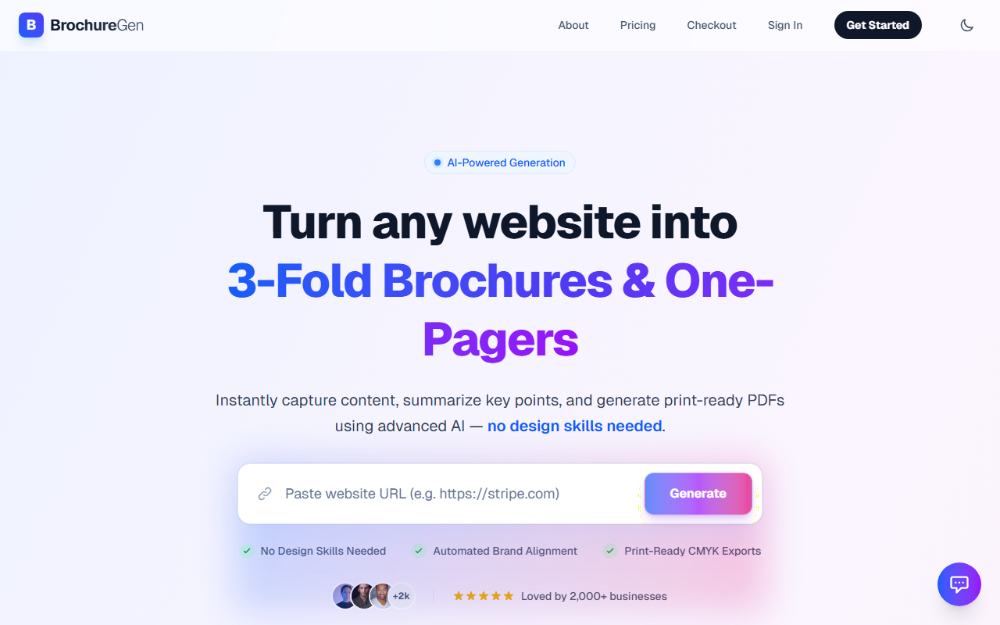

# BrochureGen 🎨✨

> **Turn any website URL into a professional, print-ready PDF brochure in seconds using AI.**



[](https://nextjs.org/)
[](https://tailwindcss.com/)
[](https://python.org/)
[](https://fastapi.tiangolo.com/)
[](https://playwright.dev/)

---

## 🚀 Overview

**BrochureGen** is an AI-powered SaaS platform that automates the creation of marketing materials. By simply pasting a URL (e.g., a Zillow listing, a LinkedIn profile, or a company home page), our engine scrapes the content, analyzes the brand identity, and generates a stunning, high-resolution PDF brochure ready for print or digital distribution.

### ✨ Key Features

-   **🤖 AI Content Extraction**: Automatically pulls text, images, and brand colors from any URL.
-   **🎨 Auto-Branding**: Matches the brochure's color palette and typography to the source website.
-   **📄 Print-Ready PDFs**: Generates CMYK-compatible, high-resolution PDFs (300 DPI).
-   **⚡ Real-Time Preview**: Edit and refine your brochure in the browser before exporting.
-   **🔌 Developer API**: Integrate brochure generation into your own CRM or app.
-   **📱 Responsive & Modern**: Built with a mobile-first, dark-mode-ready UI.

---

## 🛠️ Tech Stack

### Frontend (`/frontend`)
-   **Framework**: Next.js 14 (App Router)
-   **Styling**: Tailwind CSS + custom glassmorphism effects
-   **Icons**: Heroicons & lucide-react
-   **Motion**: Framer Motion (animate-in/out)
-   **State**: React Hooks + Context

### Backend (`/backend`)
-   **API**: FastAPI (Python)
-   **Scraping**: Playwright (Headless Chromium)
-   **PDF Engine**: FPDF / ReportLab
-   **AI**: OpenAI API / Custom NLP logic
-   **Database**: PostgreSQL (Supabase ready)

---

## 🏁 Getting Started

### Prerequisites
-   Node.js 18+
-   Python 3.9+
-   Pip & Virtualenv

### 1. Clone the Repository
```bash
git clone https://github.com/donmckinney12/brochuregen.git
cd brochuregen
```

### 2. Backend Setup
The backend handles scraping and PDF generation.

```bash
cd backend

# Create virtual environment
python -m venv venv

# Activate (Windows)
.\venv\Scripts\activate
# Activate (Mac/Linux)
# source venv/bin/activate

# Install dependencies
pip install -r requirements.txt
playwright install chromium

# Run the server
python run.py
```
*Backend runs on: `http://localhost:5001`*

### 3. Frontend Setup
The frontend is the user interface.

```bash
cd frontend

# Install dependencies
npm install

# Run development server
npm run dev
```
*Frontend runs on: `http://localhost:3000`*

---

## 📖 Documentation

-   [**API Reference**](/developers): Endpoints for programmatic generation.
-   [**Templates Gallery**](/templates): View available brochure designs.
-   [**Contributing Guide**](CONTRIBUTING.md): How to help build BrochureGen.

---

## 📸 Screenshots

| Landing Page | Dashboard |
|:---:|:---:|
|  |  |

| Editor | Mobile View |
|:---:|:---:|
|  |  |

---

## 🗺️ Roadmap

- [x] MVP Launch (Landing, Auth, Basic Gen)
- [x] Blog & Content Marketing Engine
- [x] Developer API (Beta)
- [ ] User Accounts & Saved Brochures
- [ ] Team Collaboration Features
- [ ] Multi-Page Booklet Support

---

## 📄 License

This project is licensed under the MIT License - see the [LICENSE](LICENSE) file for details.

---

<p align="center">
  Built with ❤️ by the BrochureGen Team
</p># brochuregen
