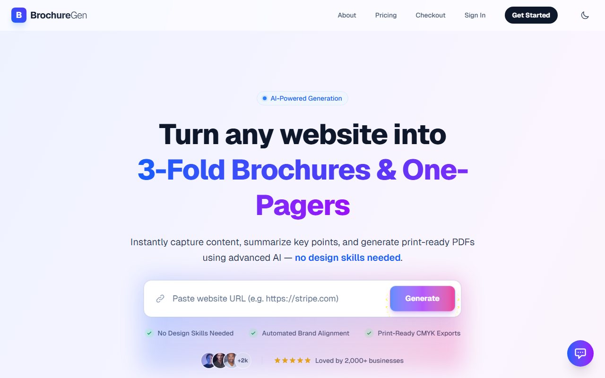

# BrochureGen 🎨✨

> **The world's most advanced AI brochure generation platform. Turn any URL into a high-converting, print-ready marketing powerhouse in seconds.**

---

## 🗺️ Roadmap

- [x] **v0.1** - MVP (Scraping & Basic PDF)
- [x] **v0.2** - Stripe Integration & Auth (Complete)
- [ ] **v0.3** - Brand Vault & Credit Scheduler
- [ ] **v0.4** - Enterprise API & CRM Sync
- [ ] **v1.0** - Official Launch

---

## 📄 License

MIT © BrochureGen Team

<p align="center">
  Built with ❤️ for High-Impact Growth.
</p>


[](https://nextjs.org/)
[](https://tailwindcss.com/)
[](https://fastapi.tiangolo.com/)
[](https://clerk.com/)
[](https://playwright.dev/)

---

## 🚀 Overview

**BrochureGen** is a SaaS engine for automated marketing collateral generation. It allows users to scrape any URL, analyze brand identity via AI, and deliver professional, industry-specific brochures.

### ✨ Key Features

-   **🤖 AI Engine**: Advanced content extraction and copywriting using GPT-4o.
-   **🏦 Brand Vault**: Centralized management of brand logos, colors, and voice.
-   **💳 Stripe Integration**: Seamless subscription management and automated billing.
-   **📈 Credit Scheduler**: Automated monthly credit resets with intelligent rollover.
-   **📊 Shared Analytics**: Privacy-first performance tracking for your brochures.
-   **🌗 Dynamic Theming System**: Toggles between Corporate, Modern, and Creative layouts.
-   **📄 Print-Ready CMYK PDFs**: Professional grade output for high-end printing.

---

## 🛠️ Tech Stack

### Frontend (`/frontend`)
-   **Framework**: Next.js 16 (App Router)
-   **Runtime**: React 19
-   **Auth**: Clerk
-   **Styling**: Tailwind CSS 4.0
-   **Analytics**: Recharts
-   **Motion**: Framer Motion

### Backend (`/backend`)
-   **API**: FastAPI (Python 3.12+)
-   **Scraping & PDF**: Playwright 1.49
-   **AI**: OpenAI API (GPT-4o)
-   **Database**: PostgreSQL (via SQLAlchemy)
-   **Payments**: Stripe

---

## 🏁 Getting Started

### 1. Prerequisites
-   Node.js 20+
-   Python 3.12+

### 2. Backend Setup
```bash
cd backend
python -m venv .venv
source .venv/bin/activate # Windows: .venv\Scripts\activate
pip install -r requirements.txt
playwright install chromium
python run.py
```

### 3. Frontend Setup
```bash
cd frontend
npm install
npm run dev
```

